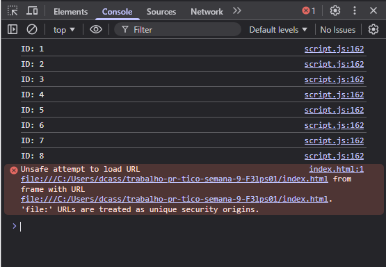
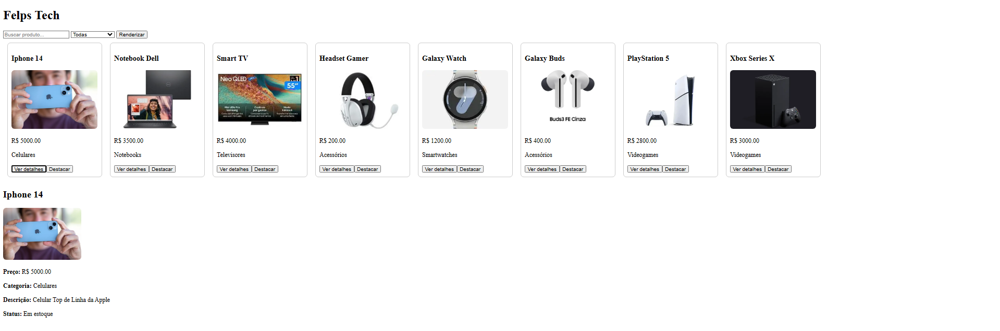

# 🛒 Mini Ecommerce – Catálogo em Cards

## Autor

Nome: Felipe Gabriel Nogueira Aquino
Matrícula: 923614

---

## Sobre o projeto

Este projeto foi desenvolvido como atividade prática para treinar **funções em JavaScript e manipulação do DOM**.

A proposta foi criar uma página simples no estilo eCommerce, onde os produtos são exibidos em formato de **cards**, utilizando dados de um JSON.

Durante o desenvolvimento, foi possível entender melhor como o JavaScript interage com o HTML, criando elementos dinamicamente e permitindo a interação do usuário.

---

## Funcionalidades

* Listagem de produtos em cards
* Filtro por nome (campo de busca)
* Filtro por categoria
* Exibição de detalhes do produto
* Destaque visual de produtos
* Renderização dinâmica usando JavaScript

---

## Tecnologias utilizadas

* HTML
* CSS (básico)
* JavaScript (DOM e eventos)

---

## Prints do projeto

### Cards renderizados

---

### Detalhes do produto

---

### Console do navegador

### Tela do Site

---

## Aprendizados

Com essa atividade, foi possível aprender e praticar:

Manipulação do DOM (`createElement`, `appendChild`, `innerHTML`)
Seleção de elementos (`getElementById`, `querySelector`, `querySelectorAll`)
Uso de eventos (`addEventListener`)
Organização do código com funções
Uso de dados em formato JSON
Interação dinâmica com o usuário

---

## Considerações finais

Este projeto foi importante para consolidar conceitos fundamentais de JavaScript e entender, na prática, como construir interfaces dinâmicas.

---
